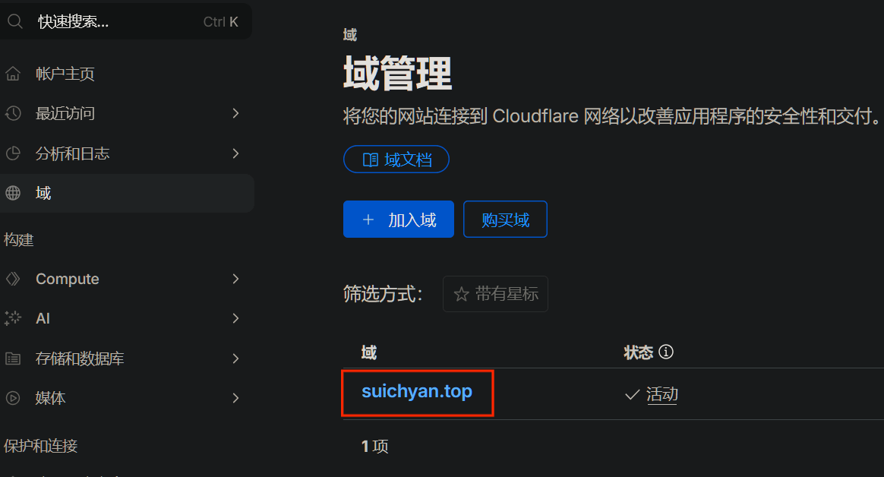
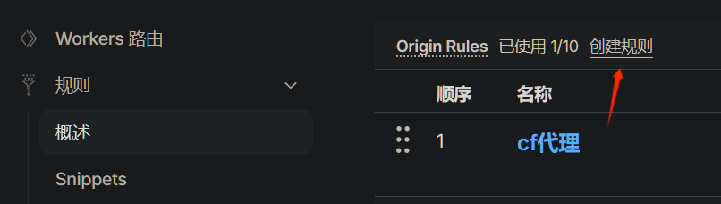
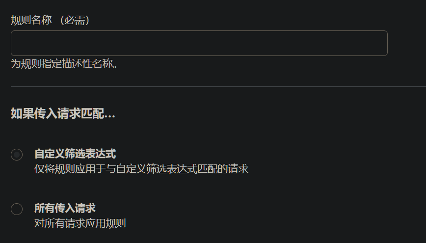
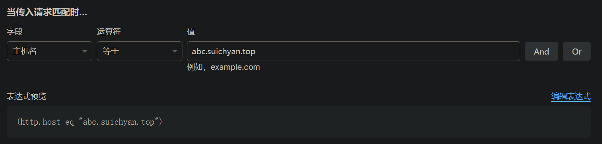
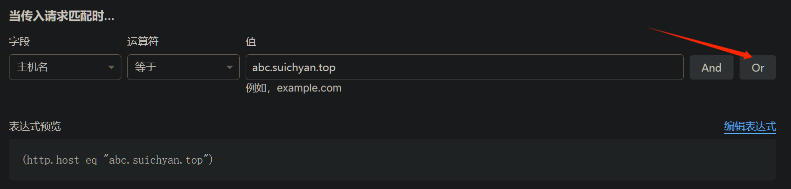
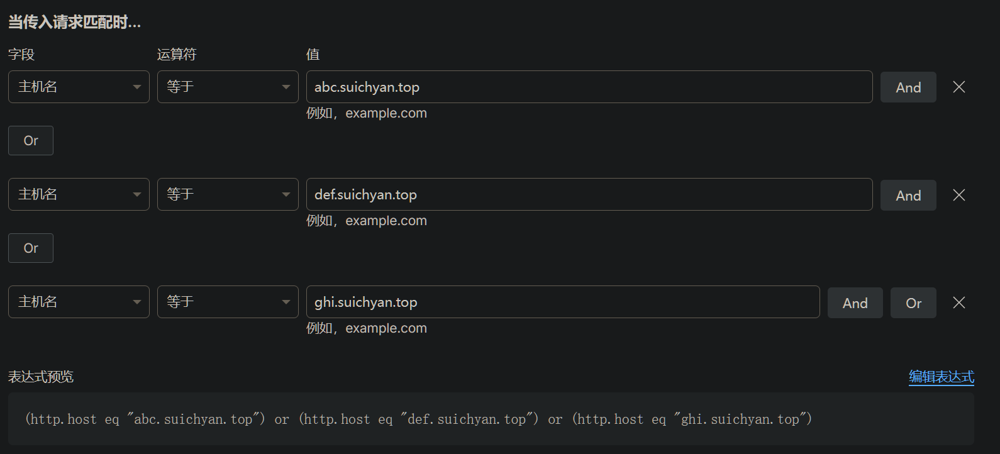
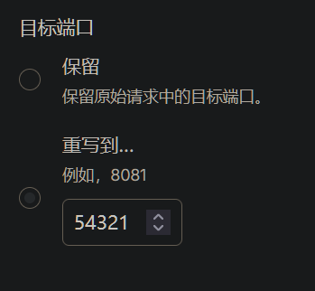
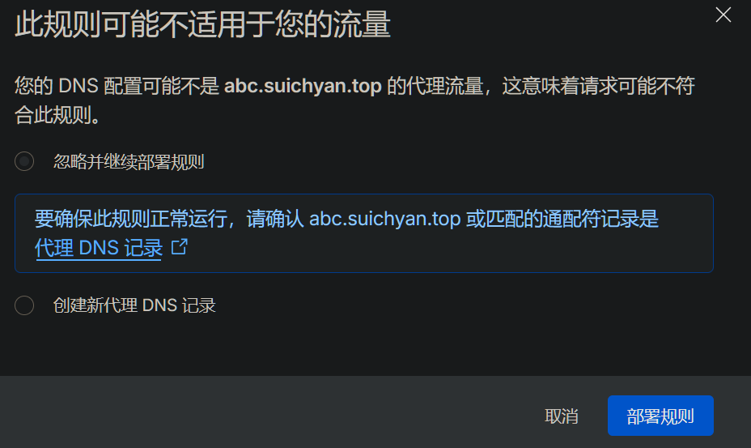
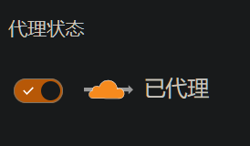
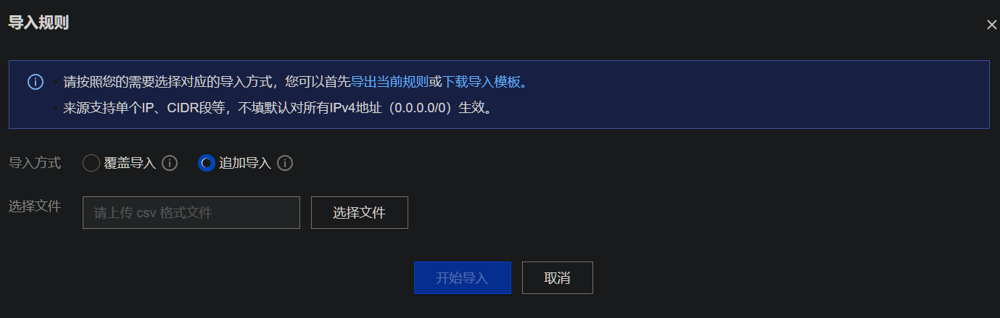

在服务器上配置好caddy反代后，因为没有备案只能使用高位端口来访问。但是每次访问都需要使用域名加上端口，非常麻烦。而且因为Cloudflare支持的端口有限，没法使用cf代理，服务器安全性无法得到保障。

### Cloudflare支持的端口

| HTTP协议 | HTTPS协议 |
| :------: | :-------: |
|    80    |    443    |
|   8080   |   2053    |
|   8880   |   2083    |
|   2052   |   2087    |
|   2082   |   2096    |
|   2086   |   8443    |
|   2095   |     -     |

在不使用80或443的情况下，访问域名就需要加上端口，例如：`https://blog.suichyan.top:8443`

### 设置Cloudflare回源规则

使用回源规则重写端口来直接访问域名

1. 访问[Cloudflare](https://www.cloudflare.com/zh-cn/)，登录，点击已经加入的域



2. 左侧面板找到`规则`→`概述`→`Origin Rule`→`创建规则`



3. 填写规则名称（随便编一个），选择`自定义筛选表达式`



4. 配置筛选条件：

- 字段选择`主机名`
- 运算符选择`等于`
- 值填入反代的主机名，例如：`abc.suichyan.top`



1. 如果有多个主机名，点击右侧`Or`，然后反复按照第四步配置




6. 配置完主机名后，转到下面目标端口：

- 选择`重写到...`
- 端口号填写反代的端口，例如：`54321`



7. 最后点击部署

> 如果提示此规则可能不适用于您的流量，如图：
> 
> 需要将解析的域名勾选代理状态，然后再次重试部署规则
> 

至此现在您可以直接通过域名访问网站不需要加端口了，例如：`https://blog.suichyan.top`

### 防止 Cloudflare 被绕过

但是你可能发现使用原来带上端口的方法仍然能够访问，这涉及到 Web 服务器的工作原理和**源站保护**的安全问题

这里采用最简单的方式，直接配置源服务器防火墙，反代的端口只允许Cloudflare访问

#### 腾讯云服务器防火墙

因为在使用腾讯云，所以这里例举腾讯云防火墙的配置方法

1. 将之前开放的端口规则删除
2. 在任意位置编写一个`cloudflare_rules.csv`文件

```csv
来源,协议,端口,策略,备注
173.245.48.0/20,TCP,40000,允许,Cloudflare IPv4节点
103.21.244.0/22,TCP,40000,允许,Cloudflare IPv4节点
103.22.200.0/22,TCP,40000,允许,Cloudflare IPv4节点
103.31.4.0/22,TCP,40000,允许,Cloudflare IPv4节点
141.101.64.0/18,TCP,40000,允许,Cloudflare IPv4节点
108.162.192.0/18,TCP,40000,允许,Cloudflare IPv4节点
190.93.240.0/20,TCP,40000,允许,Cloudflare IPv4节点
188.114.96.0/20,TCP,40000,允许,Cloudflare IPv4节点
197.234.240.0/22,TCP,40000,允许,Cloudflare IPv4节点
198.41.128.0/17,TCP,40000,允许,Cloudflare IPv4节点
162.158.0.0/15,TCP,40000,允许,Cloudflare IPv4节点
104.16.0.0/13,TCP,40000,允许,Cloudflare IPv4节点
104.24.0.0/14,TCP,40000,允许,Cloudflare IPv4节点
172.64.0.0/13,TCP,40000,允许,Cloudflare IPv4节点
131.0.72.0/22,TCP,40000,允许,Cloudflare IPv4节点
2400:cb00::/32,TCP,40000,允许,Cloudflare IPv6节点
2606:4700::/32,TCP,40000,允许,Cloudflare IPv6节点
2803:f800::/32,TCP,40000,允许,Cloudflare IPv6节点
2405:b500::/32,TCP,40000,允许,Cloudflare IPv6节点
2405:8100::/32,TCP,40000,允许,Cloudflare IPv6节点
2a06:98c0::/29,TCP,40000,允许,Cloudflare IPv6节点
2c0f:f248::/32,TCP,40000,允许,Cloudflare IPv6节点
```

3. 添加服务器的防火墙规则

- 选择导入规则
- 选择追加导入
- 选择刚才编写的csv文件



4. 再次尝试能否带端口访问，如果不能就是配置成功了

---

最后检查能否不带端口访问网页  
如果能，那么恭喜你🎉，网站成功被cf代理
